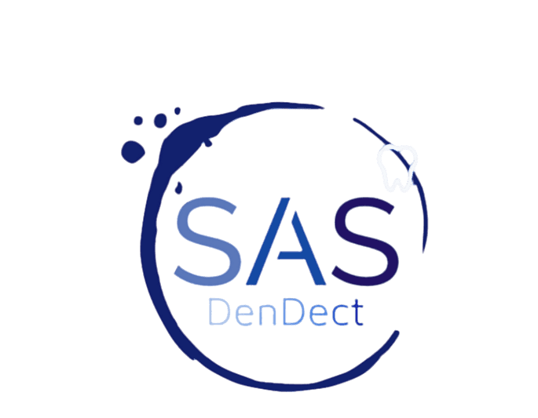

# DenDect

## Overview
The analysis of dental radiographs is a crucial step in the diagnosis process in routine clinical practice since the dentist must evaluate tooth-related issues throughout the clinical diagnosis. Human error may cause manual analysis to provide false predictions. The automated approach for identifying and categorizing dental issues will help in the early diagnosis of diseases and might help prevent tooth loss. Our goal is to create a model that may offer a second viewpoint and to simplify reporting for dentists. This project suggests a convolutional neural network architecture known as the YOLOv7 that takes panoramic radiographs (X-ray images) as its input and performs multilabel detection of four categories of different teeth problems, that are: conservative (fillings and crowns), implant, RCT (root canal treatment), and bridges.
After undergoing data preprocessing and augmentation, the YOLOv7 architecture is used to detect the teeth problems for its excellent detection quality, its accuracy, and speed. The performance of the model is measured using the mAP metric.

The code in this repositry runs a web application containing a login,home, and upload page. In the upload page you can upload dental panoramic x-ray image, and the model would return the image with the predicted classes for the users viewing.

## Enviroment

This project was programmed using Python 3.8, since it supports the packages that were required in this work; Moreover, the main compiler used was Google ColabProPlus. The model was trained using the “A100” GPU, that has a memory of 40GB, and the RAM had a capacity of 80 GB.
The model was constructed using the PyTorch Frameowork.

## Pre-processing, Annotation, and Augumentation
- For pre-processing the images were cropped to only show the jaw area then resized to 608x331 size.
- Then the objects in the images were annotated with bounding boxes using Roboflow.
- The following augmentation was applied to the images:
      - Rotation : -10° and 10°
      - Brightness: -20% and 20%
      - Exposure: -15% and 15%

The images now are ready to Train the model.

## Training
The annotated dataset were imported from Roboflow and then used to train the model

    %cd /content/yolov7
    !python train.py --workers 8 --device 0 --data /content/yolov7/SaS-4/data.yaml --img-size 608 331 --batch 32 --cfg /content/yolov7/cfg/training/yolov7.yaml --weights /content/yolov7/yolov7_training.pt --epochs 50 --hyp /content/hyp.yaml --adam
    
## Testing Results
To test our model the following code was used 

    !python test.py --data /content/yolov7/SaS-4/data.yaml  --batch 32 --conf 0.001 --device 0 --weights /content/best.pt --task test

These are the results of testing the model, showcasing the precision, recall, mAP@ IoU threshold 0.5, and mAP@ IoU threshold 0.5:0.95

**The model has achieved a mAP score 90.2%.**

## How to start the web application

To clone the repositry on your device:

    !git clone https://github.com/SaifAburaisi/SaS_GraduationProject.git
    
Install all the required packages from the requirements.txt file:

    !pip install -r requirements.txt
   
Navigate to the SaS_Web_Application folder:
   
    !cd .\SaS_Web_Application\ 
   
Run the web application server file using:

    !python manage.py runserver

